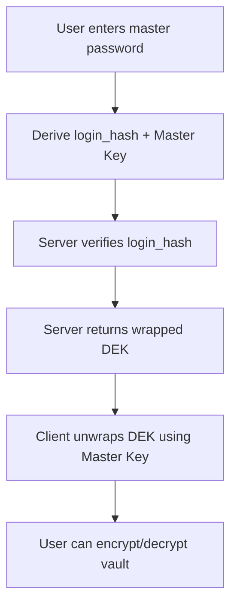

# Argon2id Key Derivation in Vaultlock

## Overview

Vaultlock uses **Argon2id** for password hashing and key derivation. This is the foundation of our zero-knowledge architecture.

## Why Argon2id?

- Winner of the Password Hashing Competition (2015)
- Resistant to GPU and ASIC attacks (memory-hard)
- Resistant to side-channel attacks
- Configurable memory, iterations, and parallelism

## Parameters Used

We follow OWASP recommendations:

- **Memory**: 19 MiB (19456 KiB)
- **Iterations**: 2
- **Parallelism**: 1
- **Algorithm**: Argon2id v0x13

This provides a good balance between security and login speed (~0.5–1 second on modern hardware).

## Two Separate Derivations

We derive **two different values** from the master password:

1. **`login_hash`** — Used only for server-side authentication
2. **`Master Key`** — Used only client-side to encrypt/decrypt the user's vault

This separation is critical for zero-knowledge security.

## Flow

## Implementation

- Backend: `backend/src/crypto/argon2.rs`
- Client: To be implemented in Tauri / React Native / Browser Extension

## References

- [OWASP Password Storage Cheat Sheet](https://cheatsheetseries.owasp.org/cheatsheets/Password_Storage_Cheat_Sheet.html)
- [Argon2 RFC](https://datatracker.ietf.org/doc/html/draft-irtf-cfrg-argon2-03)