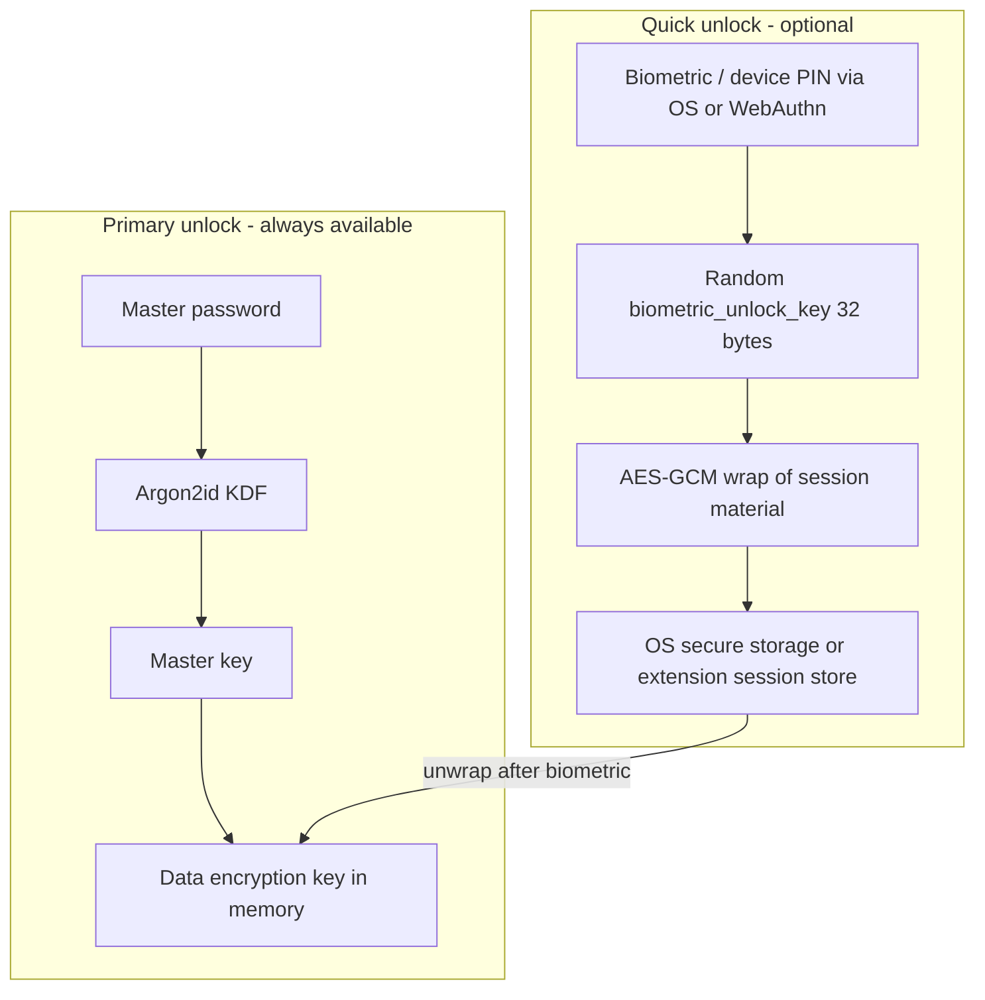
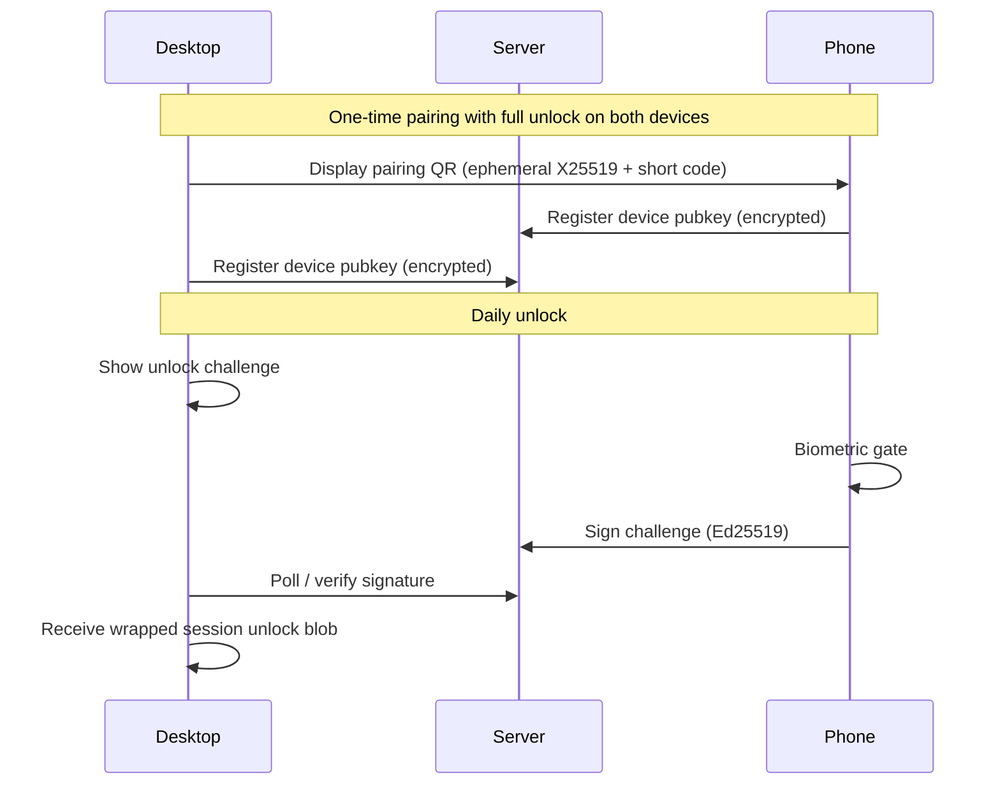

# Secure Biometric Vault Unlock

**Status:** Proposed  
**Date:** May 20, 2026  
**Related:** [PROJECT_PLAN.md](../PROJECT_PLAN.md) §4 (security architecture), Phase 2 passkeys

## Overview

Add optional biometric **quick unlock** as a local-only layer on top of master-password vault unlock, using OS secure storage (native apps) and WebAuthn PRF (extension MVP). Phone-to-desktop approval is a separate Phase 2 feature built on device pairing.

**Decisions captured from product discussion:**

- Support **both** same-device biometrics (Touch ID, Windows Hello, Android fingerprint) and **phone approves desktop/extension** (Phase 2).
- **Browser extension** must ship in the first biometric release (WebAuthn PRF; weaker than native Keychain — see below).

---

## Current state (important constraint)

Vaultlock has **no client unlock flow yet** — only backend JWT login from a client-supplied Argon2id PHC hash and crypto helpers (`wrap_dek` / `unwrap_dek`) in [backend/src/crypto/aes_gcm.rs](../../backend/src/crypto/aes_gcm.rs) and [extension/src/crypto/aes_gcm.ts](../../extension/src/crypto/aes_gcm.ts). The documented zero-knowledge model ([PROJECT_PLAN.md](../PROJECT_PLAN.md) §4) — separate login hash, `wrapped_dek` on user, client-only decryption — is **not wired**.

**Biometrics must not be built before core unlock exists.** Biometric unlock is a convenience gate on a **locally stored, randomly generated key** — never a replacement for master-password KDF.

---

## Security model (non-negotiable rules)

| Rule | Rationale |
|------|-----------|
| **Never derive vault keys from biometrics** | Biometrics are not secrets; templates can change; attackers with device access differ from offline DB theft |
| **Biometric unlock key is random** | Generated once when user opts in; stored only inside hardware-backed or WebAuthn-gated storage |
| **Master password remains root of trust** | Required on first login, after password change, after disabling biometrics, after N failures, and on new device |
| **Server never sees biometric data or BUK** | Zero-knowledge preserved; optional `biometric_unlock_enabled` flag is metadata only |
| **Lock clears in-memory DEK** | Auto-lock timer + explicit lock; zeroize sensitive buffers (align with [TESTING.md](../TESTING.md)) |
| **Re-enable biometrics requires full unlock** | Prevents attacker who briefly has unlocked vault from enrolling their face |

**What biometrics protect:** casual access when the vault is locked but the device is otherwise in use.

**What they do not protect:** malware in the unlocked process, rooted/jailbroken devices, stolen offline DB without OS encryption, or a known master password.

---

## Cryptographic design (shared across clients)

Add to planned `shared/crypto/` (or duplicate minimally until shared package exists):

1. **`VaultSession`** (in-memory only after unlock)
   - Holds `dek: Uint8Array` (32 bytes), `unlockedAt`, `expiresAt`
   - API: `lock()`, `isExpired()`, `touch()`

2. **`QuickUnlockEnvelope`** (persisted locally)
   - `version`, `salt`, `nonce`, `ciphertext` where plaintext = `dek` OR a derived `session_key` that unwraps a locally cached copy of server `wrapped_dek`
   - Wrapped with **`biometric_unlock_key`** (32 random bytes from `crypto.getRandomValues` / OS RNG)
   - Prefer wrapping **DEK only** (smaller blast radius than caching master key)

3. **Enable flow** (user must be fully unlocked)
   - Generate `biometric_unlock_key`
   - `encrypt(dek, biometric_unlock_key)` → envelope
   - Store envelope + persist `biometric_unlock_key` via platform adapter (below)
   - Never persist `biometric_unlock_key` in plaintext outside secure storage

4. **Quick unlock flow**
   - Platform adapter prompts biometric / WebAuthn
   - Retrieves `biometric_unlock_key` → decrypt envelope → load `dek` into `VaultSession`
   - Optionally refresh JWT via existing login hash path (separate concern)

5. **Disable / invalidate**
   - Delete platform storage entry
   - Clear envelope
   - On master password change: **always** invalidate quick unlock everywhere

When implemented, fold the threat model and platform matrix into [ADR-0003](../adr/0003-biometric-quick-unlock.md) (to be created).

---

## Platform implementations

### Mobile (Expo) — strongest path, ship first

| Piece | Choice |
|-------|--------|
| Biometric prompt | `expo-local-authentication` (Face ID / Touch ID / Android BiometricPrompt) |
| Secret storage | `expo-secure-store` with **iOS Keychain** `requireAuthentication: true` / Android **Keystore** user-auth required |

- iOS: access control equivalent to `biometryCurrentSet` (invalidate if Face ID re-enrolled)
- Android: `setUserAuthenticationRequired(true)` + strong biometric only
- Settings: toggle “Unlock with biometrics”, timeout (1 min / 5 min / 15 min / never)

### Desktop (Tauri, planned) — same-device biometrics

| OS | Approach |
|----|----------|
| macOS | Keychain Services + `SecAccessControl` (`biometryCurrentSet` \| `or devicePasscode`) |
| Windows | **Windows Hello** via `windows-credentials` / `keyring` crate with protected storage |
| Linux | `secret-service` (libsecret); biometric support varies — **fallback to master password only** with clear UX |

Implement as **`tauri-plugin`** or Rust module in desktop crate calling `keyring` + platform-specific access flags. UI uses same `QuickUnlock` TS API from shared package.

### Browser extension (MVP required) — WebAuthn PRF

Extensions **cannot** call iOS/Android/macOS Keychain APIs directly. The most secure portable approach for MV3:

**WebAuthn platform authenticator + PRF extension** (Chrome 118+, Edge; check Firefox support at implementation time):

1. On opt-in (vault already unlocked): `navigator.credentials.create()` with `authenticatorAttachment: "platform"`, `residentKey: "required"`, and **PRF** `eval` with app-specific salt
2. PRF output → HKDF → `biometric_unlock_key` (deterministic per credential + salt, but **gated by biometric/PIN** each use)
3. Wrap DEK envelope; store envelope in `chrome.storage.session` (cleared on browser exit) — **not** the wrap key
4. On quick unlock: `navigator.credentials.get()` with same PRF salt → unwrap DEK

**Fallbacks (required for MVP completeness):**

- Browser/OS without PRF: show “Biometric unlock unavailable — use master password” (no insecure fallback)
- Always show master password unlock on extension popup

**Security caveats:** extension storage and WebAuthn surface are weaker than native Keychain; recommend users also use OS full-disk encryption and short auto-lock. Optional future improvement: **native messaging** to Tauri desktop for keystore-backed unlock when desktop is installed.

### Phone approves desktop/extension (Phase 2)

Separate feature from same-device biometrics; do **not** block Phase 1.

- Pairing requires **master password unlock on both devices** once
- Unlock approval: challenge–response, short TTL, constant-time verify
- Server stores only public keys + opaque pairing metadata (no DEK)
- This is **device pairing**, not WebAuthn login to server

---

## Backend / schema changes (minimal)

Biometric unlock is **client-local**. Server changes are optional and metadata-only:

- `users.quick_unlock_enabled` boolean (optional, for UX sync only)
- **Do not** store `biometric_unlock_key`, envelopes, or DEK server-side
- Completing zero-knowledge auth model first: `wrapped_dek`, `kdf_params`, separate login hash per [PROJECT_PLAN.md](../PROJECT_PLAN.md) — biometric work sits **on top** of client `wrapped_dek` unwrap

JWT session remains independent: quick unlock only restores local `dek`; API calls still use JWT (refresh as today).

---

## Implementation sequence

### Phase 0 — Prerequisites (blocking)

1. Client Argon2id KDF + master key derivation (email + password salt)
2. Register/login produces JWT; client unwraps `wrapped_dek` after login
3. `VaultSession` + auto-lock in web, extension popup, mobile shell
4. Shared crypto package: [ADR-0001](../adr/0001-monorepo-layout.md) `shared/crypto/`

### Phase 1 — Same-device quick unlock (first biometric release)

| # | Work |
|---|------|
| 1 | ADR-0003 + `QuickUnlock` module in `shared/crypto/` |
| 2 | Mobile: secure store adapter + settings UI + tests (Detox/manual checklist) |
| 3 | Extension: WebAuthn PRF adapter + popup unlock UI + feature detection |
| 4 | Tauri desktop: Keychain/Hello adapter (when `desktop/` crate exists) |
| 5 | Invalidate on password change, lock, logout, failed biometric (exponential backoff) |

### Phase 2 — Phone approves desktop/extension

1. Device pairing protocol + API endpoints
2. Desktop “Waiting for approval on phone” UI
3. Mobile push/local notification + biometric before sign
4. Revoke paired devices from settings

---

## UX defaults (secure-by-default)

- Biometrics **off** until user enables after successful master-password unlock
- Prompt copy: “Quick unlock uses your device biometrics to access keys stored on this device only. Your master password is still required on new devices and if biometrics fail.”
- Auto-lock: **5 minutes** default (configurable)
- Require master password at least every **7 days** even if biometrics succeed (configurable; industry common)
- Extension: warn when PRF unsupported

---

## Testing and review

Per [TESTING.md](../TESTING.md):

- Unit: envelope wrap/unwrap roundtrip, wrong key fails, version migration
- Property tests: no plaintext DEK in `chrome.storage.local` / SecureStore dumps
- Manual matrix: iOS Face ID, Android fingerprint, macOS Touch ID, Windows Hello, extension Chrome/Edge
- Security review gate on any PR touching `QuickUnlock` or platform adapters

---

## Recommended tickets (GitHub)

- `crypto/quick-unlock-module` — shared envelope + session
- `crypto/client-kdf-wrapped-dek` — prerequisite
- `mobile/biometric-quick-unlock`
- `extension/webauthn-prf-quick-unlock`
- `desktop/keychain-quick-unlock` (when Tauri lands)
- `docs/adr-0003-biometric-unlock`
- `sync/device-pairing-phone-unlock` — Phase 2

---

## Key risk summary

| Risk | Mitigation |
|------|------------|
| Treating biometrics as master password | ADR + code review; separate `biometric_unlock_key` |
| Extension storage exposure | WebAuthn PRF gate; session storage only; short auto-lock |
| Malware scraping unlocked memory | Auto-lock, zeroize on lock, minimize DEK lifetime |
| Phone-to-desktop MITM | Pairing with out-of-band code, Ed25519, TLS, short-lived challenges |
| Shipping before DEK flow exists | Phase 0 gate in CI/docs |
